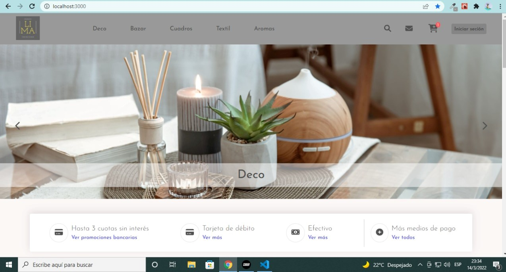

## Table of Contents
1. [General Info](#general-info)
2. [Technologies](#technologies)
3. [Installation](#installation)
4. [Home section](#HomeSection)
5. [Details section](#DetailsDection)

### General Info
***
This proyect is a E-commerce of home decoration products. It aims to provide the user with all the basic functionalities from the front-end using React.

### Screenshot
***
<figure style="text-align: center">
   
  <figcaption>Website screenshot</figcaption>
</figure>

## Technologies
***
A list of technologies used within the project:
* React JS (core library)
* React Router Dom (navigation).
* fontawesome (icons).

## Installation
***
1. You must clone the repository using  _`git clone https://github.com/MicaelaJofre/ecommercejofre.git `_
2. Then you will need to install all the dependencies of the project, for that you will need to run _`npm install` (you can also use `npm i`)_
3. Lastly, you can run the project and perform the tests using _`npm start`_

## HomeSection
***
Shows the main information of the website. With links to each section that the client can access.

## DetailsDection
***
- Shows extended information of the product searched or selected.
- You can select the quantity you want to buy, validated by the quantity in stock.